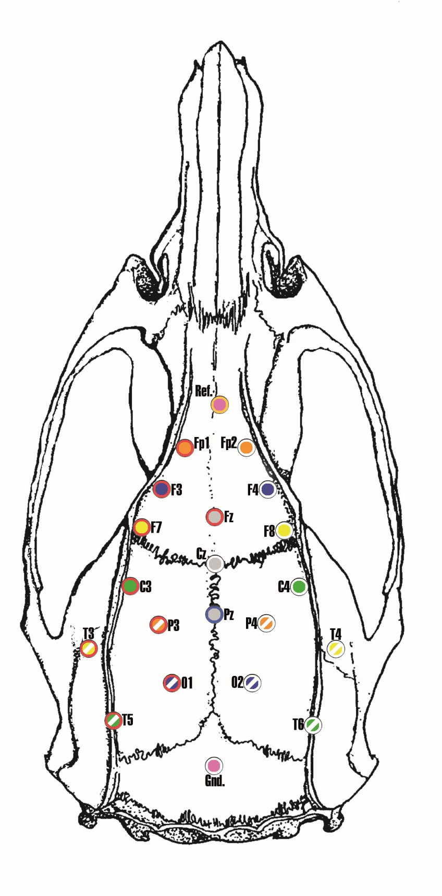

---
jupytext:
  cell_metadata_filter: -all
  formats: ipynb,py:light,md:myst
  text_representation:
    extension: .md
    format_name: myst
    format_version: 0.12
    jupytext_version: 1.6.0
kernelspec:
  display_name: Python 3
  language: python
  name: python3
---

# Biological data analysis

2020-11-16

Send solutions (ipynb and pdf or html) till 2020-11-21 23:55 to
avoicikas@gmail.com

+++

Fill in your name:

+++

Evaluation:

- Comments
- Applied methods
- Figures
- Results

+++

---
>> **TASK**
>>
>> 1. Detect eye movements (EOG)
>>
>> Recording files in EOG folder xEOG.csv where x is the subject number.
>>
>> First column - EOG vertical electrodes (V)
>>
>> Second column - EOG horizontal electrodes (V)
>>
>> Third column - time (ms)
>>
>> - Clean data, write function for multi-subject analysis automation.
>> - Detect vertical eye movement.
>> - Detect horizontal eye movement.
>> - Calculate EOG parameters (average amplitude, Inter peak time, eye blink frequency), organize, plot and export to csv file.
>> - Plot average horizontal and vertical eye blink for each subject.
>> - Plot grand average horizontal and vertical eye blink (across all
>>   subjects).
>>
>> More on EOG:
>>
>> https://en.wikipedia.org/wiki/Electrooculography
>>
>> EOG.pdf describes in detail EOG detection and general EOG morphology.
>> The task and solutions are a lot more simple then presented in the article.
>>
---

```{code-cell} ipython3

```

---
>> **TASK**
>>
>> 2. Waveform shape analysis
>>
>> Electrocorticography (ECoG) performed on rats during auditory stimulation of
>> 40 Hz.
>>
>> 
>>
>> Genetically modified schizophrenic rats response to auditory stimulation tested.
>> Data from rats left auditory channel (Al column) given in folder ECOG.
>> Around 100 stimuli were presented to each rat.
>> Data segmented into epochs (epoch column) -700 to 1200 ms (time column) around stimulus.
>>
>> - Pre-process data. Calculate average response to stimulus and its time
>>   frequency response.
>> - Compare wavelet time frequency response results with filter-hilbert method.
>> (First apply filter around stimulation and then calculate analytical signal with hilbert.)
>> - Compare methods capturing waveshape dynamics of ECoG during stimulation (0-500 ms)
>>   and baseline period (-600 -100) (Fractal dimension, turn/zerocross count,
>>   RMS)
>> - Plot all results
>>
---

```{code-cell} ipython3

```
