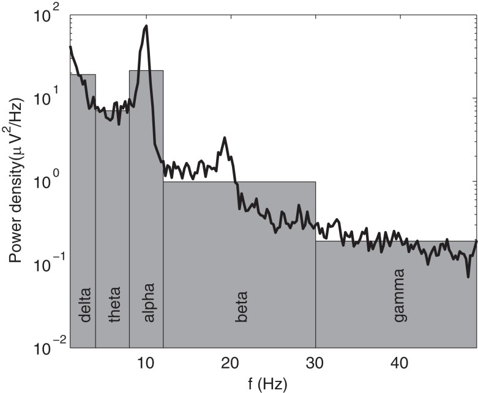
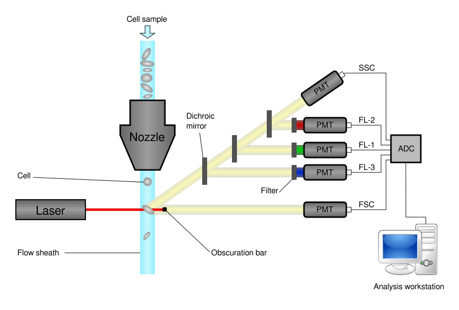

---
jupytext:
  cell_metadata_filter: -all
  formats: ipynb,py:light,md:myst
  main_language: python
  text_representation:
    extension: .md
    format_name: myst
    format_version: 0.12
    jupytext_version: 1.7.1
kernelspec:
  display_name: Python 3
  language: python
  name: python3
---

# Biological data analysis

2020-12-14

Send solutions (ipynb and pdf or html) till 2020-12-19 23:55 to
avoicikas@gmail.com

+++

Fill in your name:

```{raw-cell}

```

Evaluation:

- Comments 25%
- Applied methods 25%
- Figures 25%
- Results 25%

+++

---
>> **TASK**
>>
>> Microphones were placed in different locations.
>> 8 recordings from different microphones placed in A7 directory.
>>
>> X1... X8.wav
>>
>> All microphones captured the same environment, but since they were in
>> different locations the source-microphone distances are different.
>>
>> - Separate meaningful sources from the noise.
>>
>> - Plot the signals and their frequency compositions.
>>
>>
---

+++

To import sound `wavfile` from `scipy` can be used

```{code-cell} ipython3
from scipy.io import wavfile
```

---
>> **TASK**
>>
>> EEG recordings capture post synaptic potentials generated by networks in the brain at different frequencies as well as noise from surroundings and other body parts.
>>
>> 
>>
>> The strength of each source in different EEG channels depend on their relative distance from each channel.
>> Frontal channels are closer to eyes and we observe diminishing eyeblink amplitudes from frontal to ocipital channels.
>> Ocipital channels contains more alpha (~12 Hz) brain activity. Line noise (50 Hz) is equally distributed accross all channels.
>>
>> - Simulate EEG recording. At least 6 channels from different locations. Signal must contain eye blinks, line noise, and brain activity.
>> - Separate mixed simulated EEG recording back to sources.
>> - Plot simulated and separated signals.
>>
---

```{code-cell} ipython3

```

---
>> **TASK**
>>
>> [Flow cytometry](https://en.wikipedia.org/wiki/Flow_cytometry) allows researchers to identify, serparate and characterise different cell types. 
>> The detector and analog-to-digital conversion (ADC) system converts analog measurements of forward-scattered light (FSC) and side-scattered light (SSC) as well as dye-specific fluorescence signals into digital signals that can be processed by a computer.
>>
>> 
>>
>> cyto.csv contains data from flow cytometer.
>>
>> FSCH/SSCH are measurements of the scattering.
>> These parameters can be simplified as measures of a cell's size (FSCH) and a cell's internal complexity (SSCH).
>>
>> FL1_H ... are flourescence parameters. Different fluorochromes were used to distinguish subpopulations.
>>
>> Gate is the label given to each cell by the researcher.
>> Two gates have been identified and labelled as 1 and 2. Noise labelled as -1.
>>
>> - Explore the dataset
>> - Form a model to classify new data points as a particular gate.
>>
---

```{code-cell} ipython3

```
